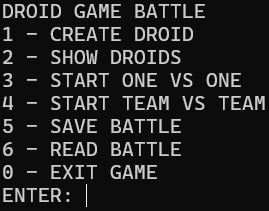
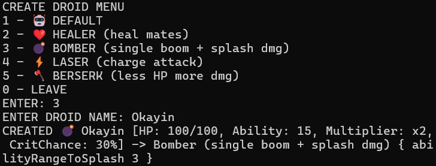
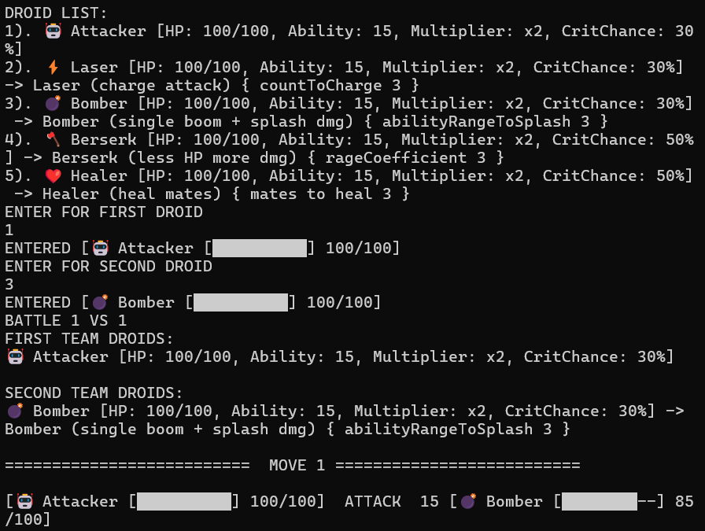
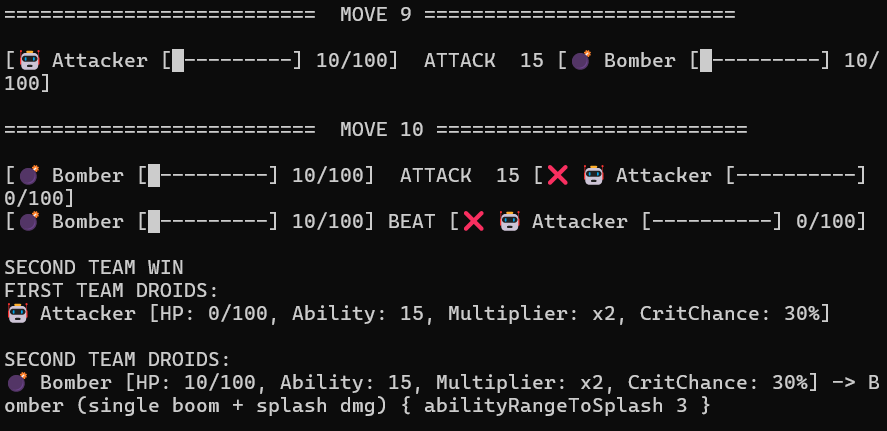
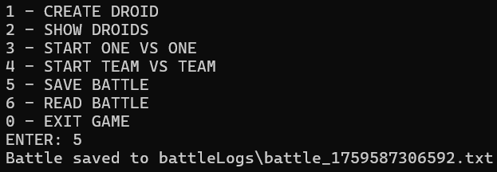
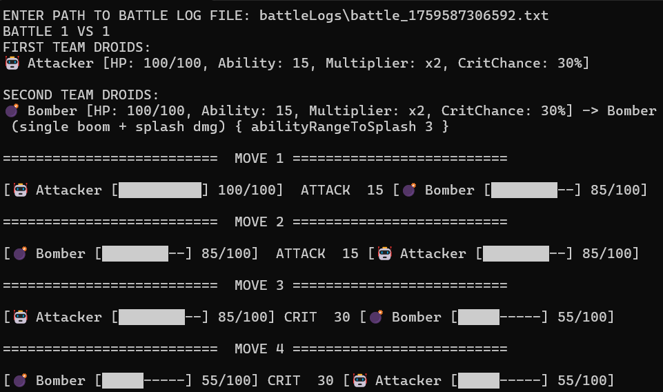

## Description

This is a DROID GAME BATTLE in console

---

# <center>Screenshot Examples</center>

## <center>Main Menu</center>



---

## <center> Create droid </center>


---

## <center> Battle 1 vs 1 </center>


...

---

## <center> Saving last battle to battle log file </center>



## <center> Reading battle from battle log file</center>



## Project Structure

```declarative
java-lab-3/
├─ src/
│  ├─ Main.java
│  ├─ battle/
│  │  ├─ AbstractBattle.java
│  │  ├─ BattleLogger.java
│  │  ├─ BattleUtils.java
│  │  ├─ OneByOneBattle.java
│  │  └─ TeamByTeamBattle.java
│  ├─ droid/
│  │  ├─ AbstractDroid.java
│  │  ├─ DefaultDroid.java
│  │  ├─ DroidFactory.java
│  │  ├─ BerserkDroid.java
│  │  ├─ BomberDroid.java
│  │  ├─ HealerDroid.java
│  │  └─ LaserDroid.java
│  └─ io/
│     └─ BattleFileManager.java
├─ battleLogs/
│  ...
```

---

# How to start

## Autostart

Run the `start.bat` file.

---

## Manual

### Compile files

```
javac -d out src/battle/*.java src/droid/*.java src/io/*.java src/Main.java
```

#### Run program

```
java -cp out Main
```

---

## Authors

- [@egorikp](https://github.com/egoRikP)